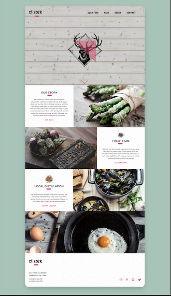

# Ce Soir - TP 

## Arborescence 
Veiller à respecter une structure de travail, ainsi que les bonnes pratiques, correspondants aux standards du métier.  

## Polices 
Caveat Brush  
Montserrat  

## Couleurs 
Vert : #A0C4B6  
Rose : #e53f6f  
Logo : #3c3d3d  
Texte : #000  

## A noter 
L'image avec les asperges doit être retournée avec du CSS pour respecter la maquette.

## Contenus 

our story

We started out with a quest for fresh game prepared in a delicate and natural way. It all began when our founder Emma Wilspan came up with the idea that a great place to eat shouldn't be hard to find or hard to enjoy. Our daily offer is frankly caught under special laws and we work directly with animal protection services and local farmers. We hope you enjoy the food from our kitchen to your plate.

est. 2004

---
fresh fare

We only use the freshest ingredients from our local farmers and organic wild caught game. All of our food is cooked without any chemicals, antibiotics or non natural additives. We only use natural and fresh herbs and spices to enhance aromas.

all natural

---

local distillation

We propose local distilled alcohol from around the area along with that finest ones from around the globe. Check out ing variety and quality of liquor on the rocks, neat, or part of a delicious cocktail.

craft liquor

---

3346 west mio street
henryville, ca 77095

tel (00) 123 456 789
tel (00) 123 456 789